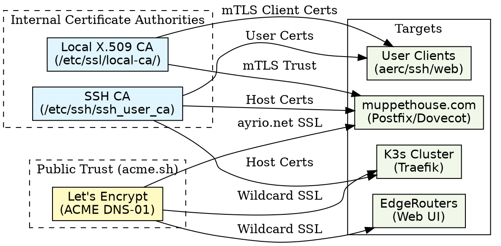
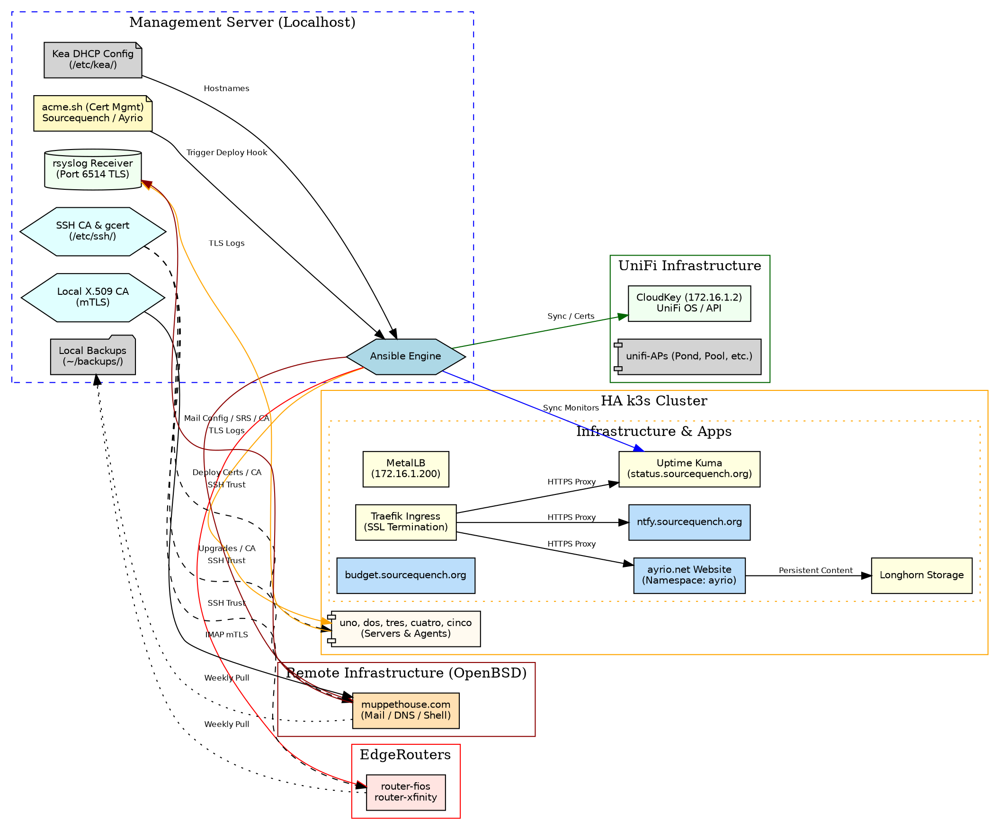

# Progress Report - SSH CA, Network & ayrio.net

This document summarizes the steps taken to implement a robust infrastructure and automated system configuration.

## Architecture & Infrastructure

### 1. Certificate Management & Trust
This diagram illustrates the multi-layered trust model:
- **SSH CA:** Manages secure shell access via User and Host certificates.
- **X.509 CA:** Issues short-lived client certificates for IMAP/SMTP mTLS.
- **Let's Encrypt (acme.sh):** Handles public X.509 certificates for Web, Mail, and VPN services with automated Ansible deployment hooks.

### 2. Service Architecture & Locations
The following diagram maps established services to their respective runtimes:

```dot
digraph services {
    rankdir=TB;
    node [shape=box, style=filled, fontname="Helvetica"];
    
    internet [label="Internet", shape=cloud, fillcolor="#cfd8dc"];

    subgraph cluster_k3s {
        label = "K3s Cluster (Local Site)";
        style=filled; color=lightgrey;
        
        ayrio [label="ayrio.net\n(Namespace: ayrio)", fillcolor="#bbdefb"];
        ntfy [label="ntfy.sourcequench.org\n(Namespace: monitoring)", fillcolor="#bbdefb"];
        status [label="status.sourcequench.org\n(Namespace: monitoring)", fillcolor="#bbdefb"];
        budget [label="budget.sourcequench.org\n(Namespace: home-services)", fillcolor="#bbdefb"];
        grafana [label="grafana.sourcequench.org\n(Namespace: monitoring)", fillcolor="#bbdefb"];
        stoat [label="stoat.sourcequench.org\n(Namespace: stoat)", fillcolor="#fff9c4", style="filled,dashed"];
    }

    subgraph cluster_openbsd {
        label = "muppethouse.com (Remote VPS)";
        style=filled; color="#ffe0b2";
        
        smtpd [label="SMTP/SMTPS\n(OpenSMTPD)", fillcolor="#ffccbc"];
        dovecot [label="IMAPS/mTLS\n(Dovecot)", fillcolor="#ffccbc"];
        shell [label="SSH Shell", fillcolor="#ffccbc"];
    }

    internet -> ayrio [label="HTTPS"];
    internet -> ntfy [label="HTTPS"];
    internet -> smtpd [label="Port 25/465"];
    internet -> dovecot [label="Port 993"];
}
```

### 3. Kubernetes Ingress & Request Flow
Request flow for internal services like `ayrio.net`:
1. **External DNS:** Resolves `ayrio.net` to the firewall WAN IP.
2. **Router-Fios:** Performs DNAT/Port Forward (443) to the MetalLB LoadBalancer IP.
3. **Traefik (Ingress):** Handles TLS termination and SNI-based routing.
4. **Service/Pod:** Routes to the target application container.

```dot
digraph k8s_flow {
    rankdir=LR;
    node [shape=box, style=filled, fontname="Helvetica"];

    user [label="User", shape=ellipse, fillcolor="#cfd8dc"];
    dns [label="External DNS\n(Hurricane Electric)", fillcolor="#fff9c4"];
    router [label="router-fios\n(DNAT Port 443)", fillcolor="#ffccbc"];
    lb [label="MetalLB\n(172.16.1.200)", fillcolor="#d1c4e9"];
    traefik [label="Traefik\n(Ingress Controller)", fillcolor="#d1c4e9"];
    svc [label="K8s Service\n(ayrio-service)", fillcolor="#bbdefb"];
    pods [label="K8s Pods\n(ayrio-deployment)", fillcolor="#bbdefb"];

    user -> dns [label="Resolve"];
    user -> router [label="HTTPS (WAN IP)"];
    router -> lb [label="Forward (443)"];
    lb -> traefik [label="Proxy"];
    traefik -> svc [label="Route (SNI)"];
    svc -> pods [label="Load Balance"];
}
```

### 4. Big-Picture Architecture & Management
The following diagram provides a comprehensive view of the entire stack, including local infrastructure, remote servers, and the automated management flows handled by Ansible and acme.sh.

## 1. Infrastructure Expansion & Security
- **OpenBSD Integration:** Added `muppethouse.com` to the Ansible inventory under the `[servers]` group.
  - Configured `ansible_become_method=doas` for OpenBSD compatibility.
  - **Surgical Passwordless Elevation:** Implemented targeted `nopass` rules in `/etc/doas.conf` allowing the `ryan` user to manage `sshd`, `smtpd`, `dovecot`, and SSL certificates without password prompts.
- **Certificate Authority Architecture:**
  - **SSH CA:** Deployed SSH User CA trust and automated Host Certificate signing for `muppethouse.com`.
  - **X.509 CA:** Established a local X.509 Root CA at `/etc/ssl/local-ca/` to issue short-lived (1-week) client certificates for mail authentication.
  - **Tooling Enhancement:** Refactored the `gcert` tool and `gcert-helper` to atomically issue both SSH and X.509 certificates from a single command.
- **NTP & Timezone:** Standardized all Kubernetes nodes and the management server on the `America/New_York` timezone and configured `systemd-timesyncd` for reliable clock synchronization.

## 2. Domain & Application Management (ayrio.net)
- **Namespace Migration:** Created the `ayrio` namespace and migrated the test Nginx deployment, updating all resource names for consistency.
- **Web Development:** 
  - Designed and deployed a modern, professional, dark-themed responsive website for `ayrio.net`.
  - Built with pure HTML/CSS/JS (no external libraries) for maximum performance and security.
  - Implemented subtle scroll animations and high-contrast typography optimized for both desktop and mobile.
- **Deployment Flow:** Developed `ansible/deploy_ayrio.sh` to provide a fast iteration cycle, synchronizing local source files directly to running pods and updating the persistent Kubernetes ConfigMap.
- **ACME & SSL:**
  - Configured `acme.sh` with Hurricane Electric (dns.he.net) DNS-01 validation for `ayrio.net`.
  - Successfully issued and deployed Let's Encrypt certificates to the k3s cluster and the OpenSMTPD/Dovecot server.
  - Resolved Traefik SNI and namespace-scoped secret access issues to ensure valid SSL termination.

## 3. Network & DNS Refinements
- **Centralized Host Management:** Created `ansible/sync_hosts.yml` to synchronize `/etc/hosts` across the entire cluster.
- **Internal Service Overrides:** 
  - Configured internal resolution for `ayrio.net`, `budget.sourcequench.org`, `grafana.sourcequench.org`, and `status.sourcequench.org` to point directly to the cluster LoadBalancer (`172.16.1.200`).
  - Integrated these overrides into CoreDNS via `coredns-custom` to ensure seamless intra-cluster communication.
- **DNS Automation:** Refactored `deploy_kea_config.yml` to automatically trigger host synchronization and CoreDNS updates whenever DHCP reservations change.

## 4. Mail Server Management (OpenSMTPD & Dovecot)
- **Configuration Automation:** Developed `ansible/setup_mail_domain.yml` to automate adding new domains, including automatic DKIM key generation via `rspamadm`.
- **Authentication (mTLS):**
  - **Dovecot IMAP:** Configured as a secure gateway to local `mbox` storage.
  - **Mandatory mTLS:** Enforced TLS Client Certificate authentication (`auth_mechanisms = external`). Dovecot maps the certificate CN directly to the system user.
- **Deliverability & Identity:**
  - Configured **SPF, DKIM, and DMARC** for `ayrio.net` to ensure high deliverability and cryptographic origin verification.
  - Implemented SNI support in `smtpd.conf` to serve multiple domain certificates on single listeners.
- **Unattended Maintenance:** 
  - Refined `ansible/deploy_mail_certs.sh` to atomically push certificates to OpenSMTPD, Dovecot, and Stalwart (fallback) directories, with pre-restart validation and post-restart health checks.

## 5. Client Integration (aerc)
- **mTLS Tunneling:** Configured `aerc` using the `imap+cmd://` scheme with a direct `socat` tunnel. This provides seamless certificate-based authentication without requiring a persistent local proxy.
- **Enhanced Viewing:** Integrated filters for `application/zip` (unzip), `image/*` (catimg), and `application/pdf` (pdftotext) for direct terminal previews.
- **UI Refinements:** Added `Enter` key support for message viewing and standardized Vim-style keybindings.

## 6. Stoat (formerly Revolt) Service Setup
- **Rebranding Analysis:** Identified the transition of the Revolt chat platform to **Stoat**.
- **Configuration Generation:** 
  - Developed `stoat/gen_k8s_secrets.sh` to generate VAPID keys, file encryption secrets, and Livekit credentials.
  - Generated `Revolt.toml`, `livekit.yml`, and `env.web` for the `stoat.sourcequench.org` domain.
- **Kubernetes Manifesting:** 
  - Created a dedicated `stoat` namespace and 10Gi Longhorn PVC (`stoat-data-pvc`).
  - Generated `stoat/k8s/stoat-full.yaml`, a comprehensive manifest containing 14 components:
    - **Databases:** MongoDB, KeyDB, RabbitMQ, and MinIO (with persistence subpaths).
    - **Backend:** Stoat API, Events, Autumn (file server), January (proxy), Gifbox, Crond, Pushd, and Voice Ingress.
    - **Livekit:** Integrated video conferencing server.
    - **Web Front-end:** The modern Stoat web application.
  - **Ingress:** Configured Traefik `IngressRoute` with path-stripping middleware to route traffic for API, WebSocket, and media services.

## 7. Keybase & Git Signing (GPG)
- **Keybase Installation:** Installed the official Keybase Debian package (`keybase_amd64.deb`) and configured the repository for automatic updates.
- **Service Management:** Started Keybase background services (`run_keybase -g`) and verified connectivity with the `sourcequench` account.
- **GPG Key Integration:** 
  - Exported the Keybase PGP public key (`AE8A375D7FBA261C`) to the local GPG keyring.
  - Configured Git globally to use this key for mandatory commit signing (`commit.gpgsign = true`).
  - **Public Verification:** Exported the PGP public key block for addition to GitHub to enable "Verified" status on commits.

## 8. Security Remediation & History Purge
- **Hardcoded Secret Removal:** 
  - Purged hardcoded `k3s_token` from `ansible/install_k3s.yml` (moved to Ansible Vault).
  - Refactored `stoat/gen_k8s_secrets.sh` to generate a dedicated Kubernetes Secret manifest (`stoat-secrets.yaml`) instead of baking keys into ConfigMaps.
- **Git History Purge:** Performed a complete repository reset and forced-push for both `home` and `ansible` repositories to permanently remove historical records of exposed credentials.
- **Project Mandates:** Updated `GEMINI.md` with strict security guidelines requiring leading spaces for secret-bearing commands and prohibiting plaintext secrets in all project files.

## 9. Operational Tooling (Kube-Janitor)
- **Automated Cleanup:** Developed `ansible/kube_janitor.yml` to identify and prune unused Kubernetes resources (dangling PVCs, evicted pods, finished jobs).
- **Environment Stabilization:** Recreated the Ansible virtual environment with the necessary `kubernetes` and `requests` Python libraries to support automated cluster management.
- **Resource Protection:** Implemented `janitor.skip=true` labels on core namespaces (`ayrio`, `monitoring`, `home-services`) to protect critical production infrastructure from automated cleanup.

## 10. Mail Server Reliability (Alias Fix & SRS)
- **Loop Resolution:** Fixed a critical infinite loop in the `ayrio.net` virtual alias table that was causing "524 5.2.4 Mailing list expansion problem" errors.
- **SMTPS Authentication:** Enabled mandatory password-based authentication on port 465 (`smtps auth`) to support standard mail clients like Thunderbird using system credentials.

## 11. Automated Certificate Deployment (acme.sh)
- **Centralized Orchestration:** Created `ansible/deploy_certs.sh` as a master deployment script to handle multiple domains and multi-target pushes (Kubernetes, EdgeRouters, OpenBSD Mail).
- **Custom acme.sh Hook:** Developed and registered a custom `ansible` deploy hook (`~/.acme.sh/deploy/ansible.sh`) that integrates `acme.sh` directly with the project's Ansible infrastructure.
- **Multi-Target Pushes:**
  - **sourcequench.org:** Wildcard certificates are now automatically pushed to Traefik (via `configure_traefik_ssl.yml`) and EdgeRouters (via `deploy_router_certs.yml`).
  - **ayrio.net:** Certificates are now automatically pushed to both the Kubernetes `ayrio` namespace and the OpenBSD mail server (`muppethouse.com`) upon renewal.

## 12. Mail Reputation & Spam Control
- **Strict Spam Rejection:** Configured `/etc/rspamd/local.d/actions.conf` on `muppethouse.com` to explicitly **reject** high-score spam (score > 15) instead of tagging/forwarding it.
- **Reputation Recovery:** By stopping the forwarding of "Marriott/Costco" spam via SRS to Gmail/Mimecast, the IP reputation of `71.19.146.184` is now in a recovery phase.
- **Mimecast Compatibility:** 
  - Identified a persistent "Temporary failure" loop with Mimecast MTAs (e.g., `acce.org`) caused by their use of large outbound IP pools triggering greylisting.
  - **Whitelisting:** Extracted 20+ Mimecast US IP subnets from official SPF records and added them to the `<company-white>` PF table on `muppethouse.com` to bypass greylisting entirely for these trusted senders.

## Current State
The infrastructure provides a high-security, automated environment for web and mail services. Authentication is primarily identity-based via SSH, X.509 certificates, and PGP for Git provenance. The `ayrio.net` ecosystem is fully production-ready, including high-deliverability mail support and automated end-to-end SSL lifecycle management. The **Stoat** service is fully staged for Kubernetes deployment.

## Managed Inventory Expansion

| Hostname | Group / Role | IP Address | OS / Hardware | Status |
| :--- | :--- | :--- | :--- | :--- |
| **muppethouse.com** | Mail Server / Shell | 71.19.146.184 | OpenBSD 7.7 (amd64) | ✅ Online |
| **ayrio.net** | Web / Nonprofit Serv. | 172.16.1.200 | Kubernetes (ayrio NS) | ✅ Online |
| **stoat.sourcequench.org** | Chat Platform | 172.16.1.200 | Kubernetes (stoat NS) | 🛠 Staged |

## TODOs
- [x] Establish Local X.509 CA for mail authentication. ✅ 2026-03-08
- [x] Configure mandatory mTLS for Dovecot IMAP. ✅ 2026-03-08
- [x] Implement `aerc` mTLS tunnel via `socat`. ✅ 2026-03-08
- [x] Setup SPF/DKIM/DMARC for `ayrio.net`. ✅ 2026-03-08
- [x] Stage Stoat (Revolt) Kubernetes manifests. ✅ 2026-03-09
- [x] Install Keybase and configure Git PGP signing. ✅ 2026-03-10
- [x] Purge repository history of exposed credentials. ✅ 2026-03-10
- [x] Implement Kube-Janitor for automated resource cleanup. ✅ 2026-03-10
- [x] Resolve ayrio.net mail loop and implement SRS. ✅ 2026-03-10
- [x] Finalize `acme.sh` deployment hook for automated certificate pushes. ✅ 2026-03-11
- [x] Implement strict spam rejection to improve mail reputation. ✅ 2026-03-11
- [ ] Apply Stoat manifests and verify service availability.
- [ ] Re-evaluate JMAP (Stalwart) if version 0.15+ becomes available in OpenBSD ports.

